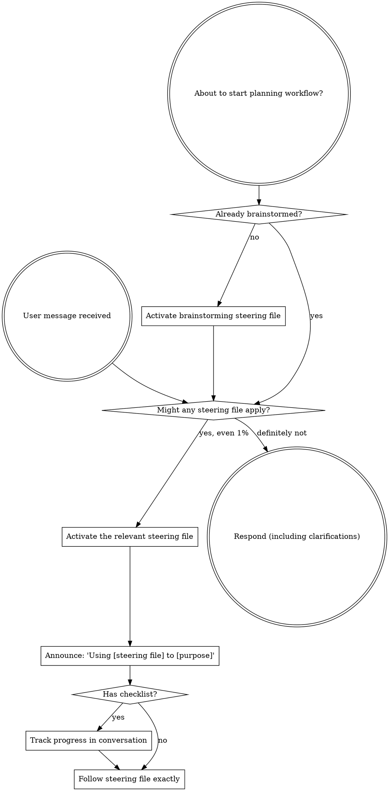

<sub-agent-STOP>
If you were dispatched as an `invoke_sub_agent` sub-agent to execute a specific task, skip this steering file.
</sub-agent-STOP>

<EXTREMELY-IMPORTANT>
If you think there is even a 1% chance a steering file might apply to what you are doing, you ABSOLUTELY MUST activate it.

IF A STEERING FILE APPLIES TO YOUR TASK, YOU DO NOT HAVE A CHOICE. YOU MUST USE IT.

This is not negotiable. This is not optional. You cannot rationalize your way out of this.
</EXTREMELY-IMPORTANT>

## Instruction Priority

Superpowers steering files override default system prompt behavior, but **user instructions always take precedence**:

1. **User's explicit instructions** (workspace steering files, direct requests) — highest priority
2. **Superpowers steering files** — override default system behavior where they conflict
3. **Default system prompt** — lowest priority

If a workspace steering file says "don't use TDD" and a superpowers steering file says "always use TDD," follow the user's instructions. The user is in control.

## How to Access Steering Files

**In Kiro IDE:** Steering files are activated via `#context-key` references in chat or loaded automatically based on their `inclusion` setting. Use `discloseContext` to activate a manual steering file by name. Never use `read_file` / `read_files` / `readCode` tools on steering files — they are loaded through the proper activation mechanism.

# Using Steering Files

## The Rule

**Activate relevant steering files BEFORE any response or action.** Even a 1% chance one might apply means you should activate it. If an activated steering file turns out to be wrong for the situation, you don't need to follow it.

## Red Flags

These thoughts mean STOP—you're rationalizing:

| Thought | Reality |
|---------|---------|
| "This is just a simple question" | Questions are tasks. Check for steering files. |
| "I need more context first" | Steering file check comes BEFORE clarifying questions. |
| "Let me explore the codebase first" | Steering files tell you HOW to explore. Check first. |
| "I can check git/files quickly" | Files lack conversation context. Check for steering files. |
| "Let me gather information first" | Steering files tell you HOW to gather information. |
| "This doesn't need a formal process" | If a steering file exists, use it. |
| "I remember this steering file" | Steering files evolve. Read current version. |
| "This doesn't count as a task" | Action = task. Check for steering files. |
| "The steering file is overkill" | Simple things become complex. Use it. |
| "I'll just do this one thing first" | Check BEFORE doing anything. |
| "This feels productive" | Undisciplined action wastes time. Steering files prevent this. |
| "I know what that means" | Knowing the concept ≠ using the steering file. Activate it. |

## Steering File Priority

When multiple steering files could apply, use this order:

1. **Process steering files first** (brainstorming, debugging) - these determine HOW to approach the task
2. **Implementation steering files second** (frontend-design, mcp-builder) - these guide execution

"Let's build X" → brainstorming first, then implementation steering files.
"Fix this bug" → debugging first, then domain-specific steering files.

## Steering File Types

**Rigid** (TDD, debugging): Follow exactly. Don't adapt away discipline.

**Flexible** (patterns): Adapt principles to context.

The steering file itself tells you which.

## User Instructions

Instructions say WHAT, not HOW. "Add X" or "Fix Y" doesn't mean skip workflows.

#[[file:using-superpowers/references/kiro-ide-tools.md]]
