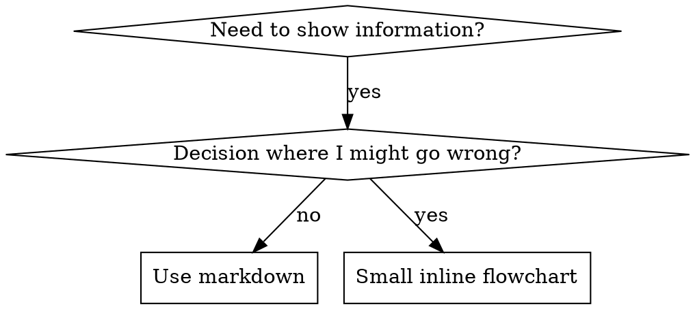

# Writing Skills

## Overview

**Writing skills IS Test-Driven Development applied to process documentation.**

**Steering files live in `.kiro/steering/` within the workspace.**

You write test cases (pressure scenarios with sub-agents), watch them fail (baseline behavior), write the steering file (documentation), watch tests pass (agents comply), and refactor (close loopholes).

**Core principle:** If you didn't watch an agent fail without the steering file, you don't know if the steering file teaches the right thing.

**REQUIRED BACKGROUND:** You MUST understand superpowers:test-driven-development before using this steering file. That skill defines the fundamental RED-GREEN-REFACTOR cycle. This steering file adapts TDD to documentation.

**Official guidance:** For Anthropic's official skill authoring best practices, see anthropic-best-practices.md. This document provides additional patterns and guidelines that complement the TDD-focused approach in this steering file.

## What is a Skill?

A **skill** is a reference guide for proven techniques, patterns, or tools. Skills (implemented as steering files in Kiro) help future agent instances find and apply effective approaches.

**Skills are:** Reusable techniques, patterns, tools, reference guides

**Skills are NOT:** Narratives about how you solved a problem once

## TDD Mapping for Skills

| TDD Concept | Skill Creation |
|-------------|----------------|
| **Test case** | Pressure scenario with `invoke_sub_agent` sub-agent |
| **Production code** | Steering file document |
| **Test fails (RED)** | Agent violates rule without steering file (baseline) |
| **Test passes (GREEN)** | Agent complies with steering file present |
| **Refactor** | Close loopholes while maintaining compliance |
| **Write test first** | Run baseline scenario BEFORE writing steering file |
| **Watch it fail** | Document exact rationalizations agent uses |
| **Minimal code** | Write steering file addressing those specific violations |
| **Watch it pass** | Verify agent now complies |
| **Refactor cycle** | Find new rationalizations → plug → re-verify |

The entire steering file creation process follows RED-GREEN-REFACTOR.

## When to Create a Skill

**Create when:**
- Technique wasn't intuitively obvious to you
- You'd reference this again across projects
- Pattern applies broadly (not project-specific)
- Others would benefit

**Don't create for:**
- One-off solutions
- Standard practices well-documented elsewhere
- Project-specific conventions (put in workspace steering files)
- Mechanical constraints (if it's enforceable with regex/validation, automate it—save documentation for judgment calls)

## Skill Types

### Technique
Concrete method with steps to follow (condition-based-waiting, root-cause-tracing)

### Pattern
Way of thinking about problems (flatten-with-flags, test-invariants)

### Reference
API docs, syntax guides, tool documentation (office docs)

## Directory Structure


```
.kiro/steering/
  skill-name.md              # Main steering file (required)
  skill-name/                # Supporting directory (if needed)
    supporting-file.*        # Only if needed
```

**Flat namespace** - all steering files in one searchable directory

**Separate files for:**
1. **Heavy reference** (100+ lines) - API docs, comprehensive syntax
2. **Reusable tools** - Scripts, utilities, templates

**Keep inline:**
- Principles and concepts
- Code patterns (< 50 lines)
- Everything else

## Steering File Structure

**Frontmatter (YAML):**
- Required fields: `description` and `inclusion`
- `description`: Describes ONLY when to use (NOT what it does)
  - Start with "Use when..." to focus on triggering conditions
  - Include specific symptoms, situations, and contexts
  - **NEVER summarize the steering file's process or workflow** (see CSO section for why)
- `inclusion`: One of `auto`, `manual`, or `fileMatch`
- Optional: `name`, `dependencies`, `fileMatchPattern`

```markdown
---
description: "Use when [specific triggering conditions and symptoms]"
inclusion: manual
---

# Steering File Name

## Overview
What is this? Core principle in 1-2 sentences.

## When to Use
[Small inline flowchart IF decision non-obvious]

Bullet list with SYMPTOMS and use cases
When NOT to use

## Core Pattern (for techniques/patterns)
Before/after code comparison

## Quick Reference
Table or bullets for scanning common operations

## Implementation
Inline code for simple patterns
Link to file for heavy reference or reusable tools

## Common Mistakes
What goes wrong + fixes

## Real-World Impact (optional)
Concrete results
```


## Discovery Optimization

**Critical for discovery:** The agent needs to FIND your steering file

### 1. Rich Description Field

**Purpose:** The agent reads description to decide which steering files to load for a given task. Make it answer: "Should I read this steering file right now?"

**Format:** Start with "Use when..." to focus on triggering conditions

**CRITICAL: Description = When to Use, NOT What the Steering File Does**

The description should ONLY describe triggering conditions. Do NOT summarize the steering file's process or workflow in the description.

**Why this matters:** Testing revealed that when a description summarizes the workflow, the agent may follow the description instead of reading the full content. A description saying "code review between tasks" caused the agent to do ONE review, even though the flowchart clearly showed TWO reviews (spec compliance then code quality).

When the description was changed to just "Use when executing implementation plans with independent tasks" (no workflow summary), the agent correctly read the flowchart and followed the two-stage review process.

**The trap:** Descriptions that summarize workflow create a shortcut the agent will take. The steering file body becomes documentation the agent skips.

```yaml
# ❌ BAD: Summarizes workflow - agent may follow this instead of reading steering file
description: Use when executing plans - dispatches sub-agent per task with code review between tasks

# ❌ BAD: Too much process detail
description: Use for TDD - write test first, watch it fail, write minimal code, refactor

# ✅ GOOD: Just triggering conditions, no workflow summary
description: Use when executing implementation plans with independent tasks in the current session

# ✅ GOOD: Triggering conditions only
description: Use when implementing any feature or bugfix, before writing implementation code
```

**Content:**
- Use concrete triggers, symptoms, and situations that signal this steering file applies
- Describe the *problem* (race conditions, inconsistent behavior) not *language-specific symptoms* (setTimeout, sleep)
- Keep triggers technology-agnostic unless the steering file itself is technology-specific
- If steering file is technology-specific, make that explicit in the trigger
- **NEVER summarize the steering file's process or workflow**

```yaml
# ❌ BAD: Too abstract, vague, doesn't include when to use
description: For async testing

# ❌ BAD: Mentions technology but steering file isn't specific to it
description: Use when tests use setTimeout/sleep and are flaky

# ✅ GOOD: Starts with "Use when", describes problem, no workflow
description: Use when tests have race conditions, timing dependencies, or pass/fail inconsistently

# ✅ GOOD: Technology-specific steering file with explicit trigger
description: Use when using React Router and handling authentication redirects
```

### 2. Keyword Coverage

Use words the agent would search for:
- Error messages: "Hook timed out", "ENOTEMPTY", "race condition"
- Symptoms: "flaky", "hanging", "zombie", "pollution"
- Synonyms: "timeout/hang/freeze", "cleanup/teardown/afterEach"
- Tools: Actual commands, library names, file types

### 3. Descriptive Naming

**Use active voice, verb-first:**
- ✅ `creating-skills` not `skill-creation`
- ✅ `condition-based-waiting` not `async-test-helpers`

### 4. Token Efficiency (Critical)

**Problem:** Auto-included and frequently-referenced steering files load into EVERY conversation. Every token counts.

**Target word counts:**
- Auto-included steering files: <150 words each
- Frequently-loaded steering files: <200 words total
- Other steering files: <500 words (still be concise)

**Techniques:**

**Move details to tool help:**
```bash
# ❌ BAD: Document all flags in steering file
search-conversations supports --text, --both, --after DATE, --before DATE, --limit N

# ✅ GOOD: Reference --help
search-conversations supports multiple modes and filters. Run --help for details.
```

**Use cross-references:**
```markdown
# ❌ BAD: Repeat workflow details
When searching, use invoke_sub_agent with template...
[20 lines of repeated instructions]

# ✅ GOOD: Reference other steering file
Always use subagents (50-100x context savings). REQUIRED: Use [other-steering-file] for workflow.
```

**Compress examples:**
```markdown
# ❌ BAD: Verbose example (42 words)
User: "How did we handle authentication errors in React Router before?"
You: I'll search past conversations for React Router authentication patterns.
[use invoke_sub_agent with search query: "React Router authentication error handling 401"]

# ✅ GOOD: Minimal example (20 words)
User: "How did we handle auth errors in React Router?"
You: Searching...
[use invoke_sub_agent → synthesis]
```

**Eliminate redundancy:**
- Don't repeat what's in cross-referenced steering files
- Don't explain what's obvious from command
- Don't include multiple examples of same pattern

**Verification:**
```bash
wc -w .kiro/steering/path/file.md
# Auto-included steering files: aim for <150 each
# Other frequently-loaded: aim for <200 total
```

**Name by what you DO or core insight:**
- ✅ `condition-based-waiting` > `async-test-helpers`
- ✅ `using-skills` not `skill-usage`
- ✅ `flatten-with-flags` > `data-structure-refactoring`
- ✅ `root-cause-tracing` > `debugging-techniques`

**Gerunds (-ing) work well for processes:**
- `creating-skills`, `testing-skills`, `debugging-with-logs`
- Active, describes the action you're taking

### 4. Cross-Referencing Other Steering Files

**When writing documentation that references other steering files:**

Use steering file name only, with explicit requirement markers:
- ✅ Good: `**REQUIRED:** Activate superpowers:test-driven-development`
- ✅ Good: `**REQUIRED BACKGROUND:** You MUST understand superpowers:systematic-debugging`
- ❌ Bad: `See .kiro/steering/test-driven-development.md` (unclear if required)

## Flowchart Usage



**Use flowcharts ONLY for:**
- Non-obvious decision points
- Process loops where you might stop too early
- "When to use A vs B" decisions

**Never use flowcharts for:**
- Reference material → Tables, lists
- Code examples → Markdown blocks
- Linear instructions → Numbered lists
- Labels without semantic meaning (step1, helper2)

See @graphviz-conventions.dot for graphviz style rules.

**Visualizing for the user:** Use `render-graphs.js` in this directory to render a skill's flowcharts to SVG:
```bash
./render-graphs.js ../some-skill           # Each diagram separately
./render-graphs.js ../some-skill --combine # All diagrams in one SVG
```

## Code Examples

**One excellent example beats many mediocre ones**

Choose most relevant language:
- Testing techniques → TypeScript/JavaScript
- System debugging → Shell/Python
- Data processing → Python

**Good example:**
- Complete and runnable
- Well-commented explaining WHY
- From real scenario
- Shows pattern clearly
- Ready to adapt (not generic template)

**Don't:**
- Implement in 5+ languages
- Create fill-in-the-blank templates
- Write contrived examples

You're good at porting - one great example is enough.

## File Organization

### Self-Contained Skill
```
defense-in-depth/
  SKILL.md    # Everything inline
```
When: All content fits, no heavy reference needed

### Skill with Reusable Tool
```
condition-based-waiting/
  SKILL.md    # Overview + patterns
  example.ts  # Working helpers to adapt
```
When: Tool is reusable code, not just narrative

### Skill with Heavy Reference
```
pptx/
  SKILL.md       # Overview + workflows
  pptxgenjs.md   # 600 lines API reference
  ooxml.md       # 500 lines XML structure
  scripts/       # Executable tools
```
When: Reference material too large for inline

## The Iron Law (Same as TDD)

```
NO STEERING FILE WITHOUT A FAILING TEST FIRST
```

This applies to NEW steering files AND EDITS to existing steering files.

Write steering file before testing? Delete it. Start over.
Edit steering file without testing? Same violation.

**No exceptions:**
- Not for "simple additions"
- Not for "just adding a section"
- Not for "documentation updates"
- Don't keep untested changes as "reference"
- Don't "adapt" while running tests
- Delete means delete

**REQUIRED BACKGROUND:** The superpowers:test-driven-development steering file explains why this matters. Same principles apply to documentation.

## Testing All Skill Types

Different skill types need different test approaches:

### Discipline-Enforcing Skills (rules/requirements)

**Examples:** TDD, verification-before-completion, designing-before-coding

**Test with:**
- Academic questions: Do they understand the rules?
- Pressure scenarios: Do they comply under stress?
- Multiple pressures combined: time + sunk cost + exhaustion
- Identify rationalizations and add explicit counters

**Success criteria:** Agent follows rule under maximum pressure

### Technique Skills (how-to guides)

**Examples:** condition-based-waiting, root-cause-tracing, defensive-programming

**Test with:**
- Application scenarios: Can they apply the technique correctly?
- Variation scenarios: Do they handle edge cases?
- Missing information tests: Do instructions have gaps?

**Success criteria:** Agent successfully applies technique to new scenario

### Pattern Skills (mental models)

**Examples:** reducing-complexity, information-hiding concepts

**Test with:**
- Recognition scenarios: Do they recognize when pattern applies?
- Application scenarios: Can they use the mental model?
- Counter-examples: Do they know when NOT to apply?

**Success criteria:** Agent correctly identifies when/how to apply pattern

### Reference Skills (documentation/APIs)

**Examples:** API documentation, command references, library guides

**Test with:**
- Retrieval scenarios: Can they find the right information?
- Application scenarios: Can they use what they found correctly?
- Gap testing: Are common use cases covered?

**Success criteria:** Agent finds and correctly applies reference information

## Common Rationalizations for Skipping Testing

| Excuse | Reality |
|--------|---------|
| "Skill is obviously clear" | Clear to you ≠ clear to other agents. Test it. |
| "It's just a reference" | References can have gaps, unclear sections. Test retrieval. |
| "Testing is overkill" | Untested steering files have issues. Always. 15 min testing saves hours. |
| "I'll test if problems emerge" | Problems = agents can't use steering file. Test BEFORE deploying. |
| "Too tedious to test" | Testing is less tedious than debugging bad steering file in production. |
| "I'm confident it's good" | Overconfidence guarantees issues. Test anyway. |
| "Academic review is enough" | Reading ≠ using. Test application scenarios. |
| "No time to test" | Deploying untested steering file wastes more time fixing it later. |

**All of these mean: Test before deploying. No exceptions.**


**Script: `render-graphs.js`**
- **Purpose**: Provides render graphs functionality for the skill workflow
- **Inputs**: Parameters as defined in the exported function signatures
- **Outputs**: Return value as defined in the exported function signatures

#[[file:writing-skills/render-graphs.js]]

#[[file:writing-skills/anthropic-best-practices.md]]

#[[file:writing-skills/graphviz-conventions.dot]]

#[[file:writing-skills/persuasion-principles.md]]

#[[file:writing-skills/testing-skills-with-subagents.md]]